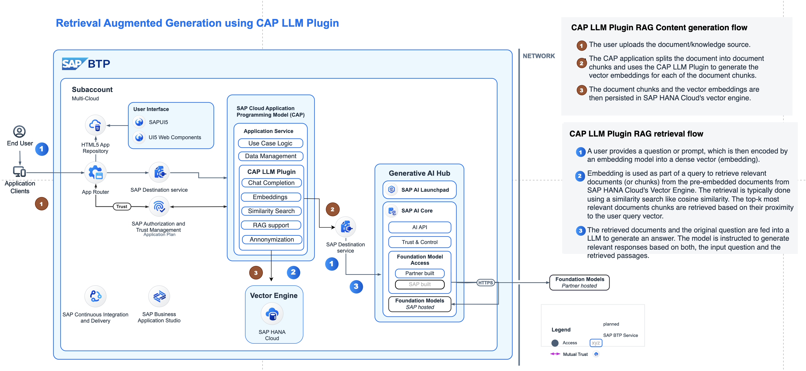

# RAG Quickstart using CAP LLM Plugin

This quickstart sample CAP application showcases a RAG scenario where the user can upload and interact with the document in a low-code setting. The application leverages the CAP LLM Plugin to seamlessly tap into the vector engine capabilities of HANA Cloud and access the LLM capabilities offered by SAP AI Core's Generative AI Hub to implement this RAG scenario.



### Pre-requisites:
 
1. [Create SAP AI Core service instance](https://help.sap.com/docs/sap-ai-core/sap-ai-core-service-guide/create-service-instance) and make sure to choose the service plan extended to activate Generative AI Hub and continue [creating a Service Key](https://help.sap.com/docs/sap-ai-core/sap-ai-core-service-guide/create-service-key). Take a note of the service key credentials.
 
2. Create model deployment in Generative AI Hub via [api](https://help.sap.com/docs/sap-ai-core/sap-ai-core-service-guide/create-deployment-for-generative-ai-model-in-sap-ai-core) or [ai-launchpad](https://developers.sap.com/tutorials/ai-core-generative-ai.html#7a5bec43-f286-4004-9b0b-6359199141da) and take a note of the following parameters once the deployment is completed.

```
deploymentUrl which looks like https://api.ai.prod.***************.ml.hana.ondemand.com/v2/inference/deployments/d15b199f47cf6e11 where d15b199f47cf6e11 is the deploymentID.
modelName like gpt-4
resourceGroupId (you generally set this while creating the ai core instance) like default
```

3. [Create SAP HANA Cloud service instance](https://developers.sap.com/tutorials/btp-app-hana-cloud-setup.html) with Vector Engine (QRC 1/2024 or later) in your BTP space.

4. Create the destination within the destination service instance in the BTP space:

- For Hybrid testing, you will have to [create a destination service instance - instructions found in step 3 of hybrid testing section](#hybrid-testing) and create the below destination within the destination service in your BTP space.
- For BTP deployment, the destination service will be created for you in the BTP space, you will have to create the below destination within the created destination service instance with the name `rag-quick-start-app-destination-service`.

Navigate to the space in the BTP cockpit, click on the destination service instance `rag-quick-start-app-destination-service` in the instances section. Click on 'Manage Instance button'. In the 'Destinations' section, click on 'Create Destination' and create the destination with the following parameters:
 
```
Name: aicore-destination
Description: SAP AI Core deployed service (generative AI hub)
URL: <AI-API-INSIDE-AI-CORE-SERVICE-KEY>
Type: HTTP
ProxyType: Internet
Authentication: OAuth2ClientCredentials
tokenServiceURL: <TOKEN-SERVICE-URL-OF-AI-CORE-SERVICE-KEY>/oauth/token
clientId: <YOUR-CLIENT-ID-OF-AI-CORE-SERVICE-KEY>
clientSecret: <YOUR-CLIENT-SECRET-OF-AI-CORE-SERVICE-KEY>
# Additional Properties:
URL.headers.AI-Resource-Group: default # adjust if necessary
URL.headers.Content-Type: application/json
HTML5.DynamicDestination: true

```

5. Configure the Generative AI Hub model configuration in your CAP application:
 
For example, in `package.json` file in your CAP application, configure the destination and model configurations as follows: 
 
```
    "cds": {
        "requires": {
            "gen-ai-hub": {
                "gpt-4": {
                  "destinationName": "GenAIHubDestination",
                  "deploymentUrl": "/v2/inference/deployments/<deploymentID from the deploymentUrl from step 2 like d15b199f47cf6e11>",
                  "resourceGroup": "<resourcegroupId from step 2 like default>",  
                  "apiVersion": "<apiVersion of the respective model like 2024-02-15-preview. For api version go to [ai core models](https://help.sap.com/docs/sap-ai-core/sap-ai-core-service-guide/models-and-scenarios-in-generative-ai-hub) and navigate to the respective model page to look for api version.>",
                  "modelName": "<modelName from step 2 like gpt-4>" 
                },
                  "text-embedding-ada-002": {
                    "destinationName": "GenAIHubDestination",
                    "deploymentUrl": "/v2/inference/deployments/<deploymentID from the deploymentUrl from step 2 like d15b199f47cf6e11>",
                    "resourceGroup": "default",
                    "apiVersion": "2024-02-15-preview",
                    "modelName": "text-embedding-ada-002"
                  }
                },
            "GenAIHubDestination": {
                "kind": "rest",
                "credentials": {
                  "destination": "aicore-destination",
                  "requestTimeout": "300000"
                }
              }
 
```
Configure atleast one chat and embedding model. Please feel free use whichever model is supported by the CAP LLM Plugin. This application is configured to leverage the following models for RAG:

Chat Models:  `gpt-4`  
Embedding Model: `text-embedding-ada-002`

Refer the [documentation](https://help.sap.com/docs/sap-ai-core/sap-ai-core-service-guide/create-deployment-for-generative-ai-model-in-sap-ai-core) for more details.

## Getting started

1.  Clone this repo.      
2.  Connect to subaccount using cf:      
` cf api <subaccount-endpoint>`    
` cf login`   

3. Install node modules using `npm install --save`

## Hybrid testing

1. Configure the UI to work for hybrid testing:

  In the `app/hr-approval-ui/webapp/controller/App.controller.js`, do the following change:

  ```
  sessionStorage.setItem("isDeployedVersion", "false");
  ```
  
2. Create HDI container (HANA service instance) and bind it to the CAP pplication as follows:  
    `cf create-service hana hdi-shared rag-quickstart-db`    
    `cf create-service-key rag-quickstart-db  SharedDevKey`   
    `cds bind -2  rag-quickstart-db:SharedDevKey`  

3. Create and bind the destination service to the CAP application as follows (which you would have done in the pre-requisites section):    
    `cf create-service destination lite rag-quick-start-app-destination-service`  
    `cf create-service-key rag-quick-start-app-destination-service SharedDevKey`  
    `cds bind -2  rag-quick-start-app-destination-service:SharedDevKey`  

4. Build the artifacts and deploy to SAP HANA Cloud:

    `cds build --production`  
    `cds deploy --to hana:rag-quickstart-db`  

- Build server and run application:
`cds watch --profile hybrid`

Note: For hydrid testing, login to the UI with the following credentials:

```
user: dummy.user@com
password: initial
```

## Deploy on SAP BTP:

1. Configure the UI to work in BTP:

  In the `app/hr-approval-ui/webapp/controller/App.controller.js`, do the following change:

  ```
  sessionStorage.setItem("isDeployedVersion", "true");
  ```

2. Run the following command to deploy server:

`cds build --production`

3. Build and deploy mtar

```
mbt build
cf deploy mta_archives/<mtar_filename>
```

## How to use the application:

- Upload policy document and generate embeddings from UI.
- Use the chat based UI for interacting with the documents.

## [Optional] Customization to use different models supported by CAP LLM Plugin

- Add the model config in the package.json as indicated in the pre-requisite section. For example, if you want to use `gemini-1.0-pro` model, configure it in the package.json as follows:

```
        "gemini-1.0-pro": {
          "destinationName": "GenAIHubDestination",
          "deploymentUrl": "/v2/inference/deployments/{DEPLOYMENT_ID like d42ed73b0a6a3333}",
          "resourceGroup": "default",
          "apiVersion": "001",
          "modelName": "gemini-1.0-pro"
        }
```
- Follow the comments in the js files under the srv folder to use any model supported by CAP LLM Plugin. If you want to customize the application to use  `gemini-1.0-pro` model, perform the following:

  - In `chat-service.js`, perform the following:
    
    - Set the chatModelName to `gemini-1.0-pro`.   
    ```
    const chatModelName = "gemini-1.0-pro";
    ```

    - Parse the output of your model response.   
    ```
            //Optional. parse other model outputs if you choose to use a different model.
            else if (chatModelName === "gemini-1.0-pro") {
                chatCompletionResponse =
                {
                    "role": chatRagResponse.completion.candidates[0].content?.role,
                    "content": chatRagResponse.completion.candidates[0].content.parts[0].text
                }
            }
    ```
  
  - In `memory-helper,js`, parse the model conversation as per its message payload format. Refer the respective model message payload.   

  ```
                //for gemini-1.0-pro chat models
                else if (modelName === "gemini-1.0-pro") {
                    messageSelectStmt.forEach(message => {
                        memoryContext.push({
                            "role": message.role,
                            "parts": [{
                                text: message.content
                            }]
                        });
                    });
                }
  ```

  Now, you will use `gemini-1.0-pro` as your chat model in this application.

  


